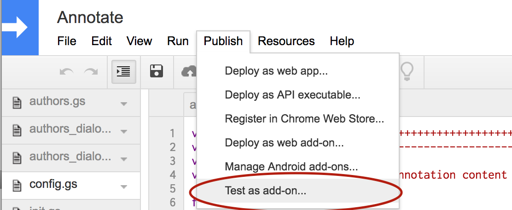

anno-docs-publish-addon
=======================

* [What is this?](#what-is-this)
* [Assumptions](#assumptions)
* [What's in here?](#whats-in-here)
* [Hide project secrets](#hide-project-secrets)
* [Run the project](#run-the-project)
* [Google Apps Scripts development](#google-apps-scripts-development)
* [Google Document Permissions](#google-document-permissions)
* [License and credits](#license-and-credits)

What is this?
-------------

Google Docs Add-on to publish a non-live factcheck.

This functionality is useful to allow for a more autonomous way of producing non-live events from the editorial perspective.

The Add-on has two functions you can run:
* Set Authorizer Token (*required*): Used to add a secret token that needs to be in sync with is expected in the [anno-lambda-authorizer](https://github.com/nprapps/anno-lambda-authorizer) repo in order for AWS API Gateway to allow the execution of the publish function.
* Publish (*required*): Asks for a factcheck `slug` and publishes the contents of the preview staging to that `slug` in production.

So the overall workflow for publishing a new non-live factcheck would be:
* Create a new document copying the [Annotations Google Doc Template](https://docs.google.com/document/d/1PYWrdnrcUJwe8dlondyN_x8SjSyLqdsxUktHSHAuvv0/edit?usp=sharing) the copy will include all the necesary code to run the Add-on.
* Run the `Set Authors Spreadsheet` addon function to link to the authors that will do the annotations.
* Add the transcript text to the document and annotate it using the AddOn.
* Run the `Publish Non-Live Preview` as many times as needed to check the results of your work.
* Once satisfied with the final result, switch to the document that contains this addon and use the `Publish` function to publish the results and make them publicly available.

Since this will create a publicly available resource the document that will host this addon is kept private for NPR, but you can use this repo to create your own publish workflow.

Assumptions
-----------

The following things are assumed to be true in this documentation.

* You are running OSX.
* You are using Python 2.7. (Probably the version that came OSX.)
* You have [virtualenv](https://pypi.python.org/pypi/virtualenv) and [virtualenvwrapper](https://pypi.python.org/pypi/virtualenvwrapper) installed and working.
* You have NPR's AWS credentials stored as environment variables locally.

For more details on the technology stack used with the app-template, see our [development environment blog post](http://blog.apps.npr.org/2013/06/06/how-to-setup-a-developers-environment.html).

What's in here?
---------------

The project contains the following folders and important files:

* ``code`` -- Google Apps Script Add-On source files
* ``fabfile`` -- [Fabric](http://docs.fabfile.org/en/latest/) commands for automating setup, deployment, data processing, etc.
* ``templates`` -- HTML ([Jinja2](http://jinja.pocoo.org/docs/)) templates, to be compiled locally.
* ``app.py`` -- A [Flask](http://flask.pocoo.org/) app for rendering the project locally.
* ``app_config.py`` -- Global project configuration for scripts, deployment, etc.
* ``render_utils.py`` -- Code supporting template rendering.
* ``requirements.txt`` -- Python requirements.

Bootstrap the project
---------------------

```
cd anno-docs-publish-addon
mkvirtualenv anno-docs-publish-addon
pip install -r requirements.txt
```

**Problems installing requirements?** You may need to run the pip command as ``ARCHFLAGS=-Wno-error=unused-command-line-argument-hard-error-in-future pip install -r requirements.txt`` to work around an issue with OSX.

Hide project secrets
--------------------

Project secrets should **never** be stored in ``app_config.py`` or anywhere else in the repository. They will be leaked to the client if you do. Instead, always store passwords, keys, etc. in environment variables and document that they are needed here in the README.

Any environment variable that starts with ``$PROJECT_SLUG_`` will be automatically loaded when ``app_config.get_secrets()`` is called.

Run the project
---------------

There's an auxiliary flask app on the repo used only to create/refresh google drive credentials in case there¡s a need to do it.

The project is meant to be deployed to google drive and executed from there.

Google Apps Scripts Development
-------------------------------

We use our codebase stored on github as the master for the Google Apps Scripts code. We have created a series of Fabric commands to ease the workflow of updating the actual code run inside google drive.

## List projects

```
fab gs.list_projects
```

It will return a complete list of Google Apps Script projects. It accepts and optional owner parameter to filter out the results to a given owner. for example the following command will return only the projects that you have created:

```
fab gs.list_projects:me
```

## Create project

If you want to create the project on your own drive, first inside `app_config.py` update `DRIVE_PARENT_FOLDER_ID` to reflect one existing folder where you want the standalone script to live in. Then you can run:

```
fab [ENVIRONMENT] gs.create
```

This will create a new google apps script project on a subfolder that will depend on the ÈNVIRONMENT used `development` or `production`.

Imagine your root folder on drive is called `scripts`. The fabric tasks expect the following folder structure:

```
scripts
| development
| production
```

## Test as an Add-On

While you are developing changes to the google apps script, we strongly recommend that you use the `Publish -> Test as add-on` option on the project until you are happy with the results.



## Upsert project

If you want to update local changes to a Google Apps Script Project you can run:

```
fab [ENVIRONMENT] gs.upsert
```

Where `ENVIRONMENT` can be: `development` or `production`. Depending on the environment passed the command will update the appropriate Google App Script Project using `app_config` properties. For development it would be:

```
fab development gs.upsert
```

Google Document Permissions
---------------------------

Google document permissions are restricted to the editors that will use the functionality to publish non-live factchecks

License and credits
---------
Released under the MIT open source license. See ``LICENSE`` for details.


Contributors
---------
This repo was developed by NPR Visuals team.

See additional ``CONTRIBUTORS``
